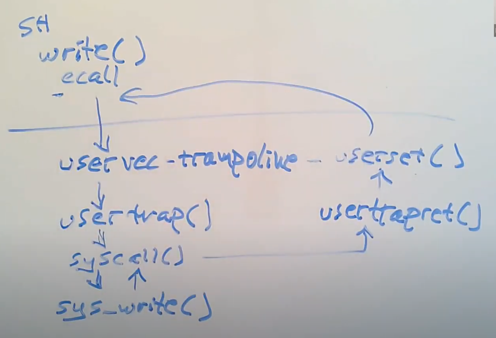

## Trap机制

### ECALL指令

1. ecall将代码从user mode改到supervisor mode。

2. ecall将程序计数器的值保存在了SEPC寄存器。

3. ecall会跳转到STVEC寄存器指向的指令。（STVEC寄存器保存的是trapmlines.s的地址）。

### uservec函数
* XV6在每个user page table映射了trapframe page，这样每个进程都有自己的trapframe page。用来保存用户寄存器的32个空槽位。其地址保存在SSCRATCH寄存器。

1. 第一件事情就是执行csrrw指令，这个指令交换了a0和sscratch两个寄存器的内容。
2. 将其他的寄存器保存在trapframe page中，
3. 从trapframe page中读取kernel_sp到sp寄存器。
4. 从trapframe page中读取CPU核的编号到tp寄存器写入将CPU核的编号也就是hartid保存在tp寄存器。
5. 从trapframe page中读取usertrap的指针到t0寄存器
6. 从trapframe page中读取kernel page table的地址到t1寄存器
7. 切换为内核页表（t1 -> satp）
8. 执行jr t0这条指令的作用是跳转到t0指向的函数中（usertrap）
### usertrap函数

* usertrap某种程度上存储并恢复硬件状态，但是它也需要检查触发trap的原因，以确定相应的处理方式。

1. 将STVEC指向了kernelvec变量，这是内核空间trap处理代码的位置，
1. 我们通过调用myproc函数查找一个根据当前CPU核的编号（上一步存储在tp寄存器）索引的数组找出当前运行进程
2. 保存用户程序计数器，它仍然保存在SEPC寄存器中，但是可能发生这种情况：当程序还在内核中执行时，我们可能切换到另一个进程，并进入到那个程序的用户空间，然后那个进程可能再调用一个系统调用进而导致SEPC寄存器的内容被覆盖。所以，我们需要保存当前进程的SEPC寄存器到一个与该进程关联的内存中，这样这个数据才不会被覆盖。这里我们使用trapframe来保存这个程序计数器。
3. 接下来我们需要找出我们现在会在usertrap函数的原因。根据触发trap的原因，RISC-V的SCAUSE寄存器会有不同的数字。数字8表明，我们现在在trap代码中是因为系统调用。
4. 将trapframe page中存储的用户程序计数器加4，返回时执行下一条指令。
5. 根据trapframe中a7的数字执行指定的系统调用。系统调用可以从trapframe中获取对应的数据。
6. 调用了一个函数usertrapret

### usertrapret函数
1. 首先关闭了中断。我们之前在系统调用的过程中是打开了中断的，这里关闭中断是因为我们将要更新STVEC寄存器来指向用户空间的trap处理代码，而之前在内核中的时候，我们指向的是内核空间的trap处理代码（6.6）。我们关闭中断因为当我们将STVEC更新到指向用户空间的trap处理代码时，我们仍然在内核中执行代码。如果这时发生了一个中断，那么程序执行会走向用户空间的trap处理代码，即便我们现在仍然在内核中，出于各种各样具体细节的原因，这会导致内核出错。
2. 设置了STVEC寄存器指向trampoline代码，在那里最终会执行sret指令返回到用户空间。
3. 接下来的几行填入了trapframe的内容，这些内容对于执行trampoline代码非常有用。

   * 存储了kernel page table的指针
   * 存储了当前用户进程的kernel stack
   * 存储了usertrap函数的指针，这样trampoline代码才能跳转到这个函数（注，详见6.5中 ld t0 (16)a0 指令）
   * 从tp寄存器中读取当前的CPU核编号，并存储在trapframe中，这样trampoline代码才能恢复这个数字，因为用户代码可能会修改这个数字
 
4. 将SEPC寄存器的值设置成之前保存的用户程序计数器的值。
5. 我们根据user page table地址生成相应的SATP值，这样我们在返回到用户空间的时候才能完成page table的切换。

### userret函数
1. 第一步是切换page table。执行csrw satp, a1
2. 将a0寄存器指向的trapframe中，之前保存的寄存器的值加载到对应的各个寄存器中。
3. 接下来，在我们即将返回到用户空间之前，我们交换SSCRATCH寄存器和a0寄存器的值。
4. 执行sret、当我执行完这条指令：

   * 程序会切换回user mode

   * SEPC寄存器的数值会被拷贝到PC寄存器（程序计数器）

   * 重新打开中断
