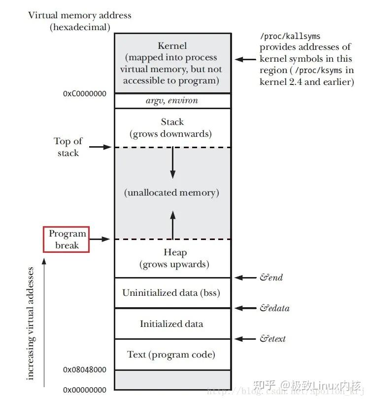

## 进程和线程之间有什么区别

进程和线程是操作系统中的两个基本概念，它们在程序执行中扮演着不同的角色。以下是它们之间的主要区别：

1. 定义
    * 进程（Process）：是操作系统分配资源的基本单位。每个进程都有自己独立的内存空间、文件句柄和其他资源。进程是一个正在执行的程序的实例。
    * 线程（Thread）：是进程中的一个执行路径。一个进程可以包含多个线程，这些线程共享进程的内存空间和资源，但各自有独立的执行路径和栈。
2. 资源分配
    * 进程：每个进程有独立的内存空间（包括代码段、数据段、堆和栈），并且拥有自己的资源（如文件句柄、信号处理等）。进程之间是相互隔离的，无法直接访问彼此的内存。
    * 线程：线程共享进程的内存空间和资源，但拥有自己独立的栈和寄存器。因为线程共享进程资源，所以线程之间的通信比进程间的通信更高效，但也更容易出现同步问题。
3. 执行开销
    * 进程：由于进程之间相互隔离，进程切换（上下文切换）的开销较大，因为操作系统需要切换内存空间和更新许多管理信息。
    * 线程：线程切换的开销较小，因为线程之间共享进程的资源，不需要切换内存空间，只需要保存和恢复少量的上下文信息。
4. 通信方式
    * 进程：进程间通信（IPC）通常依赖于操作系统提供的机制，如管道、消息队列、共享内存、信号等，这些方式相对复杂且效率较低。
    * 线程：线程之间可以直接共享进程的全局变量或堆内存，通信相对简单且高效，但需要使用同步机制（如锁、信号量）来避免竞态条件。
5. 容错性
    * 进程：由于进程之间是隔离的，一个进程的崩溃通常不会影响到其他进程。
    * 线程：线程共享进程资源，如果一个线程崩溃，可能导致整个进程的崩溃，因为它可能破坏共享的内存或资源。
6. 创建开销
    * 进程：创建一个新进程的开销较大，需要为其分配独立的资源和内存空间。
    * 线程：创建一个新线程的开销较小，因为它与现有线程共享大部分资源。

## 解释一下用户态和核心态，什么场景下，会发生内核态和用户态的切换？

用户态和核心态是操作系统中用于保护系统稳定性和安全性的两种不同的执行模式。
**用户态**（User Mode）：
在用户态下，运行的程序不能直接访问硬件资源或者执行特权指令。如果一个程序在用户态下执行了这些操作，操作系统会将其视为非法操作，并产生一个中断来阻止它。用户态程序通常受限于它们自己的地址空间，无法访问其他进程的地址空间，这样可以防止错误或恶意程序破坏系统稳定性。
**核心态**（Kernel Mode）：
核心态也称为系统态或特权模式，是操作系统内核执行代码时的状态。在核心态下，执行的代码具有最高的权限，可以直接访问所有的内存和硬件资源，执行任何CPU指令集，包括特权指令。这意味着核心态的程序可以完成用户态程序无法完成的任务，如管理进程、内存、设备驱动程序和系统资源等。

**内核态和用户态的切换场景**：
1. **系统调用**（System Call）：
   当用户程序需要执行一些只有操作系统才能执行的操作时（如文件读写、网络通信等），它会通过系统调用请求操作系统提供服务。这时，处理器从用户态切换到核心态，以便内核执行相应的操作。
2. **硬件中断**（Hardware Interrupt）：
   当硬件设备（如磁盘、网络适配器、键盘等）需要操作系统处理某个事件时，它会发送一个中断信号给CPU。CPU接收到中断后，会暂停当前的用户态程序，切换到核心态，执行中断处理程序。
3. **异常**（Exception）：
   当正在执行的程序发生错误（如页面错误、非法操作码、除以零等）时，CPU会从用户态切换到核心态，以便内核处理这些异常情况。
4. **软件中断**（Software Interrupt）：
   程序可以通过软件中断指令（如Linux的int 0x80或sysenter指令）显式地请求切换到核心态。
操作系统通过这些机制来保证系统的稳定性和安全性，同时也为应用程序提供了执行其任务所需的服务。内核态和用户态的切换是现代操作系统管理资源和保护系统免受不稳定或恶意程序影响的关键机制。

## 进程调度算法你了解多少

进程调度算法是操作系统中的一个关键部分，它负责决定哪个进程将获得CPU时间以及它们将获得多长时间。以下是一些常见的进程调度算法：
1. **先来先服务（FCFS, First-Come, First-Served）**：
   这是最简单的调度算法。进程按照它们到达就绪队列的顺序被调度。FCFS可能会导致“饥饿”现象，特别是对于长作业，因为它不考虑作业的长度。
2. **短作业优先（SJF, Shortest Job First）**：
   这个算法选择预计运行时间最短的作业来执行。它可以是非抢占式的，也可以是抢占式的（称为最短剩余时间优先，SRTF）。SJF算法可能导致长作业饥饿。
3. **优先级调度**：
   每个进程被赋予一个优先级，调度器根据优先级来选择下一个要执行的进程。更高优先级的进程会先于低优先级的进程执行。这可以是抢占式的，也可以是非抢占式的。
4. **轮转调度（Round Robin, RR）**：
   这是抢占式调度算法，每个进程被分配一个固定的时间片（quantum）。进程轮流使用CPU，如果一个进程在其时间片结束时还没有完成，它将被放回就绪队列的末尾。
5. **多级反馈队列（Multilevel Feedback Queue, MFQ）**：
   这个算法将就绪队列分成多个级别，每个级别有不同的优先级。进程可以在队列之间移动，这取决于它们的行为和需求。这个算法试图结合SJF和RR的优点。
6. **最高响应比优先（HRRN, Highest Response Ratio Next）**：
   响应比是等待时间加上估计运行时间的函数。这个算法选择具有最高响应比的进程来执行。
这些算法各有优缺点，它们的选择取决于特定的应用场景和系统需求。例如，实时系统可能需要使用特定的实时调度算法来保证任务的截止时间。


## 进程间有哪些通信方式
进程间的通信方式主要包括以下几种：
1. **管道（Pipes）**：管道是一种半双工的通信方式，只能在具有亲缘关系的进程间使用，例如父子进程。
2. **命名管道（FIFOs）**：命名管道是一种特殊的文件，可以在无关进程之间进行通信。
3. **消息队列（Message Queues）**：消息队列允许一个或多个进程向队列中写入或读取消息，它独立于发送和接收进程的存在。
4. **信号量（Semaphores）**：信号量通常用于进程间的同步操作，而不是用于传递大量数据。
5. **共享内存（Shared Memory）**：共享内存允许多个进程访问同一块内存空间，是最快的IPC方式，但需要同步机制来避免竞态条件。
6. **套接字（Sockets）**：套接字是一种可以在不同主机上的进程间进行通信的机制，支持网络通信。
7. **信号（Signals）**：信号是一种较为简单的通信方式，用于通知接收进程某个事件已经发生。
每种通信方式都有其适用的场景和优缺点，开发者可以根据实际需求选择最合适的通信机制。


## 什么是死锁，如何避免死锁？
死锁是指两个或多个进程在执行过程中，因争夺资源而造成的一种互相等待的现象，如果没有外力干预，这些进程都将无法向前推进。
**死锁的四个必要条件：**
1. **互斥条件**：资源不能被多个进程同时使用，只能由一个进程独占。
2. **持有和等待条件**：进程至少持有一个资源，并且正在等待获取其他进程持有的资源。
3. **非抢占条件**：已经分配给进程的资源在该进程完成任务前不能被抢占。
4. **循环等待条件**：存在一种进程资源的循环等待链，每个进程至少持有一个资源，并等待获取下一个进程所持有的资源。
**避免死锁的方法：**
1. **破坏互斥条件**：
   - 可以通过假脱机技术，允许共享资源在一段时间内可以被多个进程访问。
2. **破坏持有和等待条件**：
   - 进程在开始执行前必须一次性请求所有需要的资源。
   - 如果无法一次性分配所有资源，进程可以在持有部分资源的情况下释放已持有的资源，然后重新尝试获取所有资源。
3. **破坏非抢占条件**：
   - 允许资源被抢占，即当一个进程请求资源时，可以从占有资源的进程中抢占所需资源。
4. **破坏循环等待条件**：
   - 对所有资源类型进行完全排序，并要求每个进程按顺序请求资源，从而避免循环等待。
除此之外，以下是一些避免死锁的策略：
- **资源分配策略**：
  - **银行家算法**：在分配资源之前，系统会检查分配是否可能导致系统进入不安全状态，只有确认安全才进行分配。
  - **避免策略**：在进程请求资源时，系统会判断分配资源后是否可能导致死锁，只有在不会导致死锁的情况下才分配资源。
- **进程挂起策略**：
  - 当一个进程请求的资源被另一个进程持有，并且后者正在等待其他资源时，可以挂起持有资源的进程，从而打破循环等待。
- **资源分配图**：
  - 通过资源分配图来检测系统是否处于安全状态，从而避免死锁的发生。
通过上述方法，可以在设计系统时避免死锁的发生，或者在死锁发生前采取措施预防。需要注意的是，并非所有系统都能完全避免死锁，因此在设计系统时还需要考虑死锁的检测和恢复策略。

## 介绍一下几种典型的锁
1. 互斥锁：互斥锁是一种最常见的锁类型，用于实现互斥访问共享资源。在任何时刻，只有一个线程可以持有互斥锁，其他线程必须等待直到锁被释放。这确保了同一时间只有一个线程能够访问被保护的资源。
2. 自旋锁：自旋锁是一种基于忙等待的锁，即线程在尝试获取锁时会不断轮询，直到锁被释放。

其他的锁都是基于这两个锁的

* 读写锁：允许多个线程同时读共享资源，只允许一个线程进行写操作。分为读（共享）和写（排他）两种状态。
* 悲观锁：认为多线程同时修改共享资源的概率比较高，所以访问共享资源时候要上锁
* 乐观锁：先不管，修改了共享资源再说，如果出现同时修改的情况，再放弃本次操作。

## 读写锁的实现

读写锁（也叫共享/独占锁）是一种用于协调多个线程对共享资源的访问的同步原语。它允许多个线程同时读取资源，但在写入时，只有一个线程可以独占地访问资源，而其他所有线程（包括读线程）都必须等待。

在C++中，可以通过`std::shared_mutex`来实现读写锁。C++17标准引入了这个类，允许共享锁和独占锁的操作。

以下是一个简单的示例，演示如何使用C++中的读写锁：

```cpp
#include <iostream>
#include <shared_mutex>
#include <thread>
#include <vector>

// 共享数据
int shared_data = 0;
// 读写锁
std::shared_mutex rw_mutex;

// 读操作
void reader(int id) {
    while (true) {
        // 获取共享锁（读锁）
        std::shared_lock<std::shared_mutex> lock(rw_mutex);
        std::cout << "Reader " << id << " read: " << shared_data << std::endl;
        std::this_thread::sleep_for(std::chrono::milliseconds(100));
    }
}

// 写操作
void writer(int id) {
    while (true) {
        // 获取独占锁（写锁）
        std::unique_lock<std::shared_mutex> lock(rw_mutex);
        shared_data++;
        std::cout << "Writer " << id << " wrote: " << shared_data << std::endl;
        std::this_thread::sleep_for(std::chrono::milliseconds(500));
    }
}

int main() {
    std::vector<std::thread> threads;

    // 创建多个读线程
    for (int i = 0; i < 3; ++i) {
        threads.push_back(std::thread(reader, i));
    }

    // 创建多个写线程
    for (int i = 0; i < 2; ++i) {
        threads.push_back(std::thread(writer, i));
    }

    // 等待所有线程完成
    for (auto& th : threads) {
        th.join();
    }

    return 0;
}
```

### 说明：
1. `std::shared_mutex` 是 C++17 中引入的一种互斥锁，它支持共享锁（读锁）和独占锁（写锁）。
2. `std::shared_lock<std::shared_mutex>` 用于获取共享锁，这样多个线程可以同时读取数据。
3. `std::unique_lock<std::shared_mutex>` 用于获取独占锁，这样只有一个线程可以写入数据。

在这个示例中，多个读线程可以同时读取 `shared_data`，而只有一个写线程可以修改 `shared_data`。写线程修改数据时，所有的读线程和其他写线程都会被阻塞。

## 自旋锁的实现

自旋锁是一种轻量级的锁机制，它允许线程在获取锁失败时不断尝试获取锁，而不是像互斥锁那样进入休眠状态。自旋锁适用于锁的持有时间较短的场景，可以避免线程切换的开销。

以下是一个简单的C++自旋锁实现示例：

### C++ 自旋锁实现：

```cpp
#include <atomic>
#include <thread>
#include <iostream>
#include <vector>

class SpinLock {
private:
    // 使用 atomic_flag 实现自旋锁
    std::atomic_flag lock_flag = ATOMIC_FLAG_INIT;

public:
    void lock() {
        // 自旋直到获取到锁
        while (lock_flag.test_and_set(std::memory_order_acquire)) {
            // 自旋等待，主动放弃CPU资源，避免高CPU占用
            std::this_thread::yield();
        }
    }

    void unlock() {
        // 释放锁
        lock_flag.clear(std::memory_order_release);
    }
};

// 共享数据
int shared_data = 0;
SpinLock spinlock;

// 线程函数
void worker(int id) {
    for (int i = 0; i < 10; ++i) {
        // 获取自旋锁
        spinlock.lock();
        // 访问共享资源
        shared_data++;
        std::cout << "Thread " << id << " incremented shared_data to " << shared_data << std::endl;
        // 释放自旋锁
        spinlock.unlock();
        // 模拟工作
        std::this_thread::sleep_for(std::chrono::milliseconds(100));
    }
}

int main() {
    std::vector<std::thread> threads;

    // 启动多个线程
    for (int i = 0; i < 5; ++i) {
        threads.push_back(std::thread(worker, i));
    }

    // 等待所有线程结束
    for (auto& t : threads) {
        t.join();
    }

    return 0;
}
```

### 说明：

1. `std::atomic_flag` 是 C++ 标准库中提供的一个用于实现锁的低级原子操作。它只能有两个值：`true` 和 `false`。自旋锁通过反复尝试设置这个标志来判断是否获得了锁。
   - `test_and_set()`：设置 `atomic_flag` 并返回之前的值。如果返回 `true`，说明锁已经被其他线程占用，继续自旋；如果返回 `false`，则成功获取锁。
   - `clear()`：释放锁，将 `atomic_flag` 置为 `false`。
   
2. `std::this_thread::yield()`：让出当前线程的 CPU 时间片，避免在自旋过程中占用过多 CPU 资源。

### 优点：
- 实现简单，适合锁的持有时间较短的情况。
- 避免了线程切换的开销。

### 缺点：
- 如果锁的持有时间较长，可能会导致 CPU 资源浪费，因为线程会一直忙等待。


## 讲一讲你理解的虚拟内存
虚拟内存是现代操作系统中的一个重要功能，它对计算机系统的性能和稳定性有着显著的影响。以下是虚拟内存的主要作用：
1. **扩展物理内存**：
   虚拟内存允许系统使用硬盘空间作为临时的内存使用，这样即使物理内存（RAM）不足，系统也能处理更大的数据集和更多的应用程序。
2. **内存保护**：
   每个进程都有自己的虚拟地址空间，其他进程不能访问这个地址空间。这样可以防止一个进程有意或无意地修改另一个进程的数据，从而提高了系统的稳定性和安全性。
3. **数据持久化**：
   虚拟内存管理系统可以将不常用的内存页交换到硬盘上的交换文件（swap file）或交换分区（swap partition）中，从而为常用的数据腾出物理内存空间。
4. **提高多任务处理能力**：
   通过虚拟内存，操作系统可以为每个运行的应用程序提供看似连续的内存空间，即使物理内存不足，也能让多个应用程序同时运行。
5. **简化编程**：
   虚拟内存为程序员提供了一个连续的、大块的内存地址空间，这简化了内存管理，因为程序员不需要关心物理内存的实际布局。
6. **内存分配灵活性**：
   虚拟内存允许操作系统动态地分配和回收内存，而不需要连续的物理内存空间。这使得内存分配更加灵活和高效。
7. **页面置换策略**：
   虚拟内存系统可以使用不同的页面置换策略（如LRU、FIFO等）来决定哪些内存页应该被交换到硬盘上，从而优化内存使用。
8. **减少外部碎片**：
   由于虚拟内存管理器可以动态地分配和释放内存页，因此可以减少外部碎片的问题，即物理内存中分散的小空闲块。
9. **提高系统吞吐量**：
   虚拟内存使得操作系统可以更有效地使用可用资源，从而提高了整个系统的吞吐量。
总之，虚拟内存是现代计算机系统中不可或缺的组成部分，它通过提供一种抽象的内存模型，使得计算机能够更高效、更安全地运行多个应用程序和进程。

## 有哪些页面置换算法
页面置换算法是在操作系统中管理虚拟内存时使用的一种策略，用于决定当需要新的页面载入内存而内存已满时，哪个页面应该被替换出去。以下是一些常见的页面置换算法：
1. **先进先出（FIFO）算法**：
   - 这是最简单的页面置换算法。在这种算法中，操作系统维护一个队列，最先进入内存的页面在需要置换时最先被替换出去。
2. **最近最少使用（LRU）算法**：
   - LRU算法基于这样一个假设：长期未被使用的页面很可能在未来也不会被使用。因此，当需要置换页面时，会替换最长时间未被使用的页面。
3. **最不经常使用（LFU）算法**：
   - LFU算法根据页面被访问的频率来决定置换哪个页面。最少访问的页面被认为是最不可能会被再次访问的，因此被优先置换。
4. **最优页面置换算法（OPT）**：
   - 这是一种理想化的算法，它假定操作系统可以预知未来的页面请求序列，从而在每次页面置换时替换掉将来最长时间内不会被访问的页面。实际上，这是不可实现的，但它提供了一个性能评估的基准。
5. **时钟（Clock）算法**：
   - 时钟算法是一种简单的近似LRU算法。它使用一个指针在页面集合上循环，类似于时钟的移动，以决定哪个页面被替换。
每种算法都有其优缺点，适用于不同的场景和需求。在实际应用中，操作系统会根据具体的工作负载和性能目标来选择合适的页面置换算法。

## 说一下 select、poll、epoll
`select`、`poll`和`epoll`是Linux操作系统中用于IO多路复用的三种机制。它们允许程序同时监视多个文件描述符，以便它们中的任何一个准备好进行IO操作时能够得到通知。以下是它们之间的主要区别：
### select：
- **能力限制**：`select`能够监视的文件描述符数量有最大限制，通常是1024或2048，取决于系统定义的`FD_SETSIZE`。
- **效率问题**：每次调用`select`都需要重新传递整个文件描述符集合到内核空间，并且需要内核遍历整个集合来确定哪些文件描述符就绪。
- **数据结构**：使用位掩码（bitmask）来表示文件描述符集合，分别用于读、写、异常条件的监视。
- **阻塞/非阻塞**：`select`可以以阻塞或非阻塞方式工作。
- **跨平台兼容性**：`select`在多数Unix-like系统中都得到支持。
### poll：
- **能力限制**：`poll`没有最大文件描述符数量的限制，它只受系统资源的限制。
- **效率问题**：与`select`类似，每次调用`poll`也需要传递整个事件数组到内核，并且由内核遍历。
- **数据结构**：`poll`使用一个数组来传递文件描述符和事件信息，不再使用位掩码。
- **事件类型**：`poll`可以处理更多类型的事件，比`select`更加灵活。
- **跨平台兼容性**：`poll`在一些Unix-like系统中可用，但不如`select`普遍。
### epoll：
- **能力限制**：`epoll`没有文件描述符数量的限制，只受系统资源的限制。
- **效率问题**：`epoll`通过在内核中维护一个事件表来避免每次调用时都传递文件描述符集合。它使用`epoll_ctl`来添加或修改要监视的文件描述符，这使得操作效率更高。
- **数据结构**：`epoll`使用事件表，并且可以返回就绪的文件描述符列表，不需要用户遍历整个集合。
- **事件通知**：`epoll`支持边缘触发（ET）和水平触发（LT）两种模式，ET模式在文件描述符状态变化时只通知一次，而LT模式会一直通知直到条件不再满足。
- **跨平台兼容性**：`epoll`是Linux特有的机制，其他Unix-like系统通常不支持。
总结来说，`epoll`相比`select`和`poll`在处理大量文件描述符时具有更高的效率和更好的性能，特别是在高并发情况下。因此，在需要高性能网络服务器应用时，`epoll`通常是首选的IO多路复用机制。


## 协程是什么，和线程有什么区别 进程、线程、协程是几比几比几的关系
协程（Coroutine）是一种程序组件，它允许多个入口点用于暂停和恢复执行的函数，可以在单个线程内实现多任务的并发执行。协程提供了一种更轻量级的并发编程方法，与线程相比，协程有一些关键的区别：
### 协程与线程的区别：
1. **调度**：
   - **线程**：线程由操作系统的线程调度器进行调度，线程切换涉及用户态与内核态之间的转换，这种转换相对较慢。
   - **协程**：协程通常由用户程序自身进行调度，协程切换通常发生在用户态，不需要操作系统介入，因此切换开销更小。
2. **资源开销**：
   - **线程**：每个线程都有自己的堆栈和寄存器状态，线程创建和销毁的开销相对较大。
   - **协程**：协程共享同一线程的堆栈空间，协程的创建和销毁开销非常小。
3. **并发性**：
   - **线程**：多线程可以实现真正的并行计算，特别是在多核处理器上。
   - **协程**：协程通常在单个线程内实现多任务，它们通过协作来交替执行，而不是并行执行。
4. **上下文切换**：
   - **线程**：线程的上下文切换涉及复杂的操作系统操作。
   - **协程**：协程的上下文切换通常只涉及简单的寄存器操作，速度更快。
### 进程、线程、协程的关系：
进程、线程和协程之间的关系不是简单的数字比例关系，而是层次和包含关系。以下是一个简化的描述：
- **进程**：是操作系统进行资源分配和调度的基本单位，每个进程都有自己的地址空间、堆栈、数据段等。
- **线程**：是进程内的一个执行流，是CPU调度的基本单位。一个进程可以包含多个线程，它们共享进程的资源。
- **协程**：是线程内的一个执行单元，通常由程序控制，用于实现协作式的多任务处理。
因此，进程、线程和协程的关系可以表示为：
- **1个进程**可能包含**多个线程**。
- **1个线程**可能包含**多个协程**。
这种关系可以用以下比例表示：
- 进程 : 线程 : 协程 = 1 : N : M
其中N是进程中的线程数，M是线程中的协程数。实际上，这个比例会根据具体的程序设计和操作系统的情况而变化。协程的数量通常远大于线程的数量，因为协程更加轻量级，可以创建成千上万个而不会对系统造成过大的负担。


## cpu是怎么从内存中读数据的


## 软链接和硬链接

在文件系统中，软链接（Symbolic Link）和硬链接（Hard Link）是两种不同的文件链接方式，它们用于不同的目的，具有不同的特性。

### 1. 硬链接 (Hard Link)
硬链接是指多个文件名（或路径名）指向同一个物理存储块上的数据。简单来说，硬链接和原始文件是平等的，都是对相同数据块的引用。

- **特点**:
  - **相同的 inode**: 硬链接文件和原文件共享相同的 inode，意味着它们指向同一个文件数据块。
  - **不可链接到目录**: 硬链接不能指向目录，主要是为了防止创建循环链接，从而破坏文件系统的结构。
  - **删除无影响**: 如果删除了其中一个硬链接，其他指向相同数据块的链接仍然有效，文件数据不会丢失，直到最后一个链接被删除时，数据才会被释放。
  - **同一文件系统**: 硬链接只能在同一个文件系统中创建，不能跨文件系统。

### 2. 软链接 (Symbolic Link)
软链接类似于 Windows 中的快捷方式，它创建一个独立的文件，这个文件包含了指向另一个文件或目录的路径。

- **特点**:
  - **不同的 inode**: 软链接是一个独立的文件，拥有自己的 inode 和数据块，但其内容是指向另一个文件的路径。
  - **可以链接到目录**: 软链接可以指向文件或目录。
  - **跨文件系统**: 软链接可以跨文件系统指向目标文件。
  - **目标文件被删除的影响**: 如果目标文件被删除，软链接将指向一个不存在的路径，这时访问软链接会导致“无效的链接”错误。

### 使用场景
- **硬链接**: 通常用于需要为同一文件创建多个名字，同时希望所有名字都保持文件内容一致的场景。常见于备份系统或版本控制系统中。
- **软链接**: 常用于创建快捷方式或别名，特别是在需要跨文件系统或需要指向目录时。

### 示例
假设有一个文件 `file.txt`，你可以创建硬链接和软链接如下：

```bash
# 创建硬链接
ln file.txt hardlink.txt

# 创建软链接
ln -s file.txt symlink.txt
```

以上命令会创建两个新的文件 `hardlink.txt` 和 `symlink.txt`，分别作为硬链接和软链接指向原始文件 `file.txt`。

**总结**: 硬链接是多个文件名指向相同数据的方式，而软链接是独立的文件，包含了指向其他文件或目录的路径。硬链接更像是同一个文件的别名，而软链接则更像是指向目标文件的指针。

## cpu是如何执行程序的
最后我们再来回答开头的问题。 64 位相比 32 位 CPU 的优势在哪吗？64 位 CPU 的计算性能一定比 32 位 CPU 高很多吗？ 64 位相比 32 位 CPU 的优势主要体现在两个方面： 64 位 CPU 可以一次计算超过 32 位的数字，而 32 位 CPU 如果要计算超过 32 位的数字，要分多步骤进行计算，效率就没那么高，但是大部分应用程序很少会计算那么大的数字，所以只有运算大数字的时候，64 位 CPU 的优势才能体现出来，否则和 32 位 CPU 的计算性能相差不大。 通常来说 64 位 CPU 的地址总线是 48 位，而 32 位 CPU 的地址总线是 32 位，所以 64 位 CPU 可以寻址更大的物理内存空间。如果一个 32 位 CPU 的地址总线是 32 位，那么该 CPU 最大寻址能力是 4G，即使你加了 8G 大小的物理内存，也还是只能寻址到 4G 大小的地址，而如果一个 64 位 CPU 的地址总线是 48 位，那么该 CPU 最大寻址能力是 2^48，远超于 32 位 CPU 最大寻址能力。 你知道软件的 32 位和 64 位之间的区别吗？再来 32 位的操作系统可以运行在 64 位的电脑上吗？64 位的操作系统可以运行在 32 位的电脑上吗？如果不行，原因是什么？ 64 位和 32 位软件，实际上代表指令是 64 位还是 32 位的： 如果 32 位指令在 64 位机器上执行，需要一套兼容机制，就可以做到兼容运行了。但是如果 64 位指令在 32 位机器上执行，就比较困难了，因为 32 位的寄存器存不下 64 位的指令； 操作系统其实也是一种程序，我们也会看到操作系统会分成 32 位操作系统、64 位操作系统，其代表意义就是操作系统中程序的指令是多少位，比如 64 位操作系统，指令也就是 64 位，因此不能装在 32 位机器上。 总之，硬件的 64 位和 32 位指的是 CPU 的位宽，软件的 64 位和 32 位指的是指令的位宽。

## brk()与sbrk():
* brk()和sbrk()改变程序间断点的位置。程序间断点就是程序数据段的结尾。（程序间断点是为初始化数据段的起始位置）.通过增加程序间断点进程可以更有效的申请内存 。当addr参数合理、系统有足够的内存并且不超过最大值时brk()函数将数据段结尾设置为addr,即间断点设置为addr。sbrk()将程序数据空间增加increment字节。当increment为0时则返回程序间断点的当前位置。

* 返回值：

  *  brk()成功返回0，失败返回-1并且设置errno值为ENOMEM（注：在mmap中会提到）。sbrk()成功返回之前的程序间断点地址。如果间断点值增加，那么这个指针（指的是返回的之前的间断点地址）是指向分配的新的内存的首地址。如果出错失败，就返回一个指针并设置errno全局变量的值为ENOMEM。

* 总结：

  *  这两个函数都用来改变 “program break” (程序间断点)的位置，改变数据段长度（Change data segment size），实现虚拟内存到物理内存的映射。brk()函数直接修改有效访问范围的末尾地址实现分配与回收。sbrk()参数函数中：当increment为正值时，间断点位置向后移动increment字节。同时返回移动之前的位置，相当于分配内存。当increment为负值时，位置向前移动increment字节，相当与于释放内存，其返回值没有实际意义。当increment为0时，不移动位置只返回当前位置。参数increment的符号决定了是分配还是回收内存。而关于program break的位置如图所示：
  *  

## mmap()与unmmap()

## fork进程的底层：读时共享，写时复制

在Unix-like操作系统中，`fork()` 系统调用用于创建一个新的进程。这个调用几乎是瞬间完成的，因为它使用了“读时共享，写时复制”（Copy-on-Write，简称COW）的技术。以下是这一机制的详细解释：
### 读时共享
当父进程调用 `fork()` 时，操作系统会创建一个新的进程，这个新进程几乎是父进程的完整副本。但是，为了效率，并不是立即为子进程分配和复制父进程的整个地址空间。相反，子进程与父进程共享相同的物理内存页。这意味着：
- **数据段**：子进程的数据段（包括全局变量、静态变量）和父进程的数据段共享相同的物理内存页。
- **代码段**：由于代码段在进程中是只读的，子进程和父进程的代码段也会共享。
共享内存页使得 `fork()` 调用非常快速，因为它不需要立即复制大量的内存内容。
### 写时复制
当父进程或子进程试图修改共享的内存页时，会发生以下步骤：
1. **写操作触发**：当任一进程尝试写入共享内存页时，操作系统会检测到这个写操作。
2. **页表修改**：操作系统将触发写时复制机制，它会在物理内存中创建一个新的内存页，并将这个新页映射到尝试写入的进程的地址空间。
3. **数据复制**：操作系统将旧页中的数据复制到新页中，然后允许写操作在新页上执行。
4. **其他进程不受影响**：对其他进程来说，共享的原始页保持不变，因此不会受到影响。
写时复制机制确保了：
- **效率**：只有在必要时才进行内存页的复制，避免了 `fork()` 调用时的性能开销。
- **独立性**：尽管子进程开始时与父进程共享内存，但它可以在不影响父进程的情况下修改自己的内存内容。
### 底层实现
在底层，操作系统通过以下方式实现这一机制：
- **页表**：操作系统维护一个页表，它记录了虚拟内存页与物理内存页之间的映射关系。当发生写操作时，操作系统会更新页表，以反映新的映射关系。
- **引用计数**：操作系统为每个物理内存页维护一个引用计数。当 `fork()` 调用发生时，共享内存页的引用计数会增加。当任一进程退出时，操作系统会减少相应内存页的引用计数，并在引用计数降到零时释放内存页。
通过这种方式，`fork()` 系统调用能够快速创建新进程，同时仅在必要时才进行内存复制，从而优化了资源使用和性能。

## 缺页处理过程

在操作系统中，虚拟内存允许程序使用比实际物理内存更多的内存空间。当程序访问的虚拟内存页没有映射到物理内存时，就会发生“缺页”（Page Fault）。以下是缺页处理的一般过程：
### 1. 缺页异常（Page Fault Exception）
- 程序试图访问一个虚拟内存页，但该页不在物理内存中。
- 处理器检测到缺页异常，并触发操作系统内核的中断处理程序。
### 2. 中断处理
- 处理器保存当前进程的状态（如程序计数器、寄存器等）。
- 控制权转移给操作系统的缺页中断处理程序。
### 3. 确定缺页原因
- 操作系统检查缺页的原因，确认是由于合法的页缺失还是其他原因（如访问权限不足）。
- 如果是合法的缺页，继续处理；如果是其他原因，通常触发相应的错误处理（如杀死进程）。
### 4. 选择牺牲页（Victim Selection）
- 如果物理内存已满，操作系统必须选择一个页面从内存中移出，以便为新的页面腾出空间。
- 选择牺牲页的策略有很多，如最近最少使用（LRU）、先进先出（FIFO）、最少使用（LFU）等。
### 5. 回写脏页（Write Dirty Page）
- 如果牺牲页被修改过（称为“脏页”），操作系统需要将其写回磁盘上的交换空间或文件系统中。
- 这一步骤确保了数据的持久性。
### 6. 更新页表（Update Page Table）
- 操作系统更新页表，将牺牲页的映射删除，并为新页创建映射。
- 如果牺牲页被写回磁盘，页表中的状态位也会相应更新。
### 7. 加载所需页（Page In）
- 操作系统从磁盘加载所需的页面到物理内存中。
- 如果是首次访问该页，操作系统可能需要从磁盘上的程序映像或交换文件中读取。
### 8. 更新进程状态
- 缺页处理完成后，操作系统恢复进程的执行状态。
- 程序计数器重新指向触发缺页的指令，以便重新执行。
### 9. 重试缺页指令
- 缺页中断处理程序返回后，处理器重试之前触发缺页的指令。
- 由于现在所需的页已经加载到内存中，指令可以成功执行。
### 10. 恢复执行
- 进程继续执行，仿佛缺页从未发生。
这个过程对于用户和应用程序来说是透明的，它们通常不会意识到缺页的发生。操作系统通过这种机制有效地管理内存，使得程序可以高效地使用比物理内存更多的虚拟内存空间。

## 静态链接与动态链接的过程

静态链接和动态链接是程序编译和运行过程中的两个重要概念，它们在程序如何使用库函数方面有着根本的区别。以下是静态链接和动态链接的过程概述：
### 静态链接（Static Linking）
静态链接发生在程序编译阶段，链接器将程序的目标代码与所需的库代码合并，生成一个完整的可执行文件。
#### 静态链接的过程：
1. **编译**：
   - 源代码被编译成目标代码（通常是机器码），这些目标代码文件通常具有 `.o` 或 `.obj` 扩展名。
2. **符号解析（Symbol Resolution）**：
   - 链接器解析目标代码中的所有符号引用。符号包括函数名、变量名等。
   - 链接器确定每个符号定义的位置。
3. **重定位（Relocation）**：
   - 链接器更新目标代码中的符号引用，使其指向正确的内存地址。
   - 如果有多个目标文件，链接器会合并它们，解决地址冲突，并确定最终的可执行文件布局。
4. **合并**：
   - 链接器将所有目标代码和所需的静态库代码合并成一个单一的、完整的可执行文件。
5. **生成可执行文件**：
   - 最终生成的可执行文件包含了程序的所有代码和数据，可以直接运行，不依赖于任何外部库。
#### 静态链接的特点：
- 生成的可执行文件较大，因为它包含了所有需要的库代码。
- 程序运行时不需要再次加载所需的库，因此启动速度较快。
- 更新库函数需要重新编译整个程序。
### 动态链接（Dynamic Linking）
动态链接发生在程序运行阶段，操作系统在加载程序时将程序与所需的共享库链接起来。
#### 动态链接的过程：
1. **编译**：
   - 源代码被编译成目标代码，这些目标代码文件包含了位置无关代码（Position-Independent Code, PIC）。
2. **生成动态库**：
   - 静态库被编译成动态共享对象（DSO），通常具有 `.so`（Linux）、`.dll`（Windows）或 `.dylib`（macOS）扩展名。
3. **生成可执行文件**：
   - 链接器生成可执行文件，但不会将库代码合并进去。相反，它会在可执行文件中记录对动态库的引用。
4. **加载可执行文件**：
   - 当运行可执行文件时，操作系统加载器（Loader）加载可执行文件和所需的动态库。
5. **符号解析和重定位**：
   - 加载器解析可执行文件中的符号引用，并将它们重定位到动态库中相应的函数或变量。
6. **运行**：
   - 程序开始执行，操作系统负责管理对动态库的访问。
#### 动态链接的特点：
- 生成的可执行文件较小，因为它不包含库代码。
- 程序运行时需要加载所需的库，可能会稍微减慢启动速度。
- 更新库函数不需要重新编译整个程序，只需替换共享库文件。
动态链接提供了更好的资源共享和灵活性，是现代操作系统中普遍采用的链接方式。

## 孤儿进程和僵死进程

孤儿进程和僵尸进程是两种特殊的进程状态，它们在Unix-like操作系统中存在，下面分别解释这两种进程：
### 孤儿进程（Orphan Process）
孤儿进程是指父进程在子进程之前结束，而子进程还在运行的进程。当父进程终止时，孤儿进程的父进程会变成init进程（在Linux中通常是进程号为1的进程），init进程会自动调用wait()系统调用，回收孤儿进程结束时的资源。
以下是孤儿进程的特点：
- 父进程已经结束，而子进程还在运行。
- 孤儿进程不会占用太多系统资源，因为它们最终会被init进程接管。
- 系统会自动处理孤儿进程，因此通常不需要用户干预。
### 僵尸进程（Zombie Process）
僵尸进程是指子进程已经结束，但其父进程尚未调用wait()或waitpid()系统调用来获取子进程的终止状态。在这种情况下，子进程的进程表项仍然保留，以存储其退出状态，但它不再占用任何其他资源（如内存、CPU等）。
以下是僵尸进程的特点：
- 子进程已经结束，但其进程表项仍然存在。
- 僵尸进程不会占用太多系统资源，除了在进程表中保留一个条目。
- 如果父进程一直不回收僵尸进程，它们会一直存在于系统中，直到系统重启。
- 僵尸进程过多会导致系统进程表满，从而影响新进程的创建。


# 如何处理僵尸进程

处理僵尸进程的主要方法是确保其父进程能够及时调用 `wait()` 系列函数来回收子进程的资源。如果父进程不能正确处理，可能需要采取其他方法。以下是几种常见的处理僵尸进程的方法：

### 1. 修改父进程代码
如果你有权访问父进程的代码，可以确保它正确地调用 `wait()` 系列函数（如 `wait()`, `waitpid()` 等），这样父进程在子进程终止时能够自动回收资源，避免僵尸进程的产生。

### 2. 使用信号处理
父进程可以通过捕获 `SIGCHLD` 信号来处理子进程的终止。`SIGCHLD` 是在子进程终止时发送给父进程的信号，通过在父进程中注册信号处理函数，当子进程终止时自动调用 `wait()` 系列函数。

```c
void sigchld_handler(int signum) {
    while (waitpid(-1, NULL, WNOHANG) > 0);
}

int main() {
    signal(SIGCHLD, sigchld_handler);
    // 其他代码
}
```

### 3. 终止父进程
如果父进程不再需要运行，且其代码无法修改，可以通过终止父进程来间接处理僵尸进程。父进程终止后，系统会将僵尸进程的父进程转移为 `init` 进程，由 `init` 进程负责回收子进程的资源。

### 4. 手动清理僵尸进程
通过终端手动查看并清理僵尸进程。首先使用 `ps -aux | grep Z` 命令查看系统中存在的僵尸进程，然后通过 `kill` 命令终止相应的父进程（如果父进程没有重要任务运行）。

```bash
ps -aux | grep Z  # 查看僵尸进程
kill -9 <parent_process_id>  # 终止父进程
```

### 5. 重启系统
在极端情况下，如果僵尸进程过多且难以处理，重启系统可以清除所有僵尸进程。但这是最后的手段，因为它会中断系统中的其他服务和进程。

### 总结
处理僵尸进程的最佳方法是在父进程中正确处理子进程的终止，使用 `wait()` 或 `SIGCHLD` 信号处理来回收资源。如果无法修改父进程代码，终止父进程或重启系统是较为直接的方式。


# 内存管理

## linux内存布局
* 

   *  代码段，包括二进制可执行代码； 
   *  数据段，包括已初始化的静态常量和全局变量； 
   *  BSS 段，包括未初始化的静态变量和全局变量； 
   *  堆段，包括动态分配的内存，从低地址开始向上增长； 
   *  文件映射段，包括动态库、共享内存等，从低地址开始向上增长（跟硬件和内核版本有关 (opens new window)）； 
   *  栈段，包括局部变量和函数调用的上下文等。栈的大小是固定的，一般是 8 MB。当然系统也提供了参数，以便我们自定义大小；
   *  
## 为什么要有虚拟内存？
1. 第一，虚拟内存可以使得进程对运行内存超过物理内存大小，因为程序运行符合局部性原理，CPU 访问内存会有很明显的重复访问的倾向性，对于那些没有被经常使用到的内存，我们可以把它换出到物理内存之外，比如硬盘上的 swap 区域。
2. 第二，由于每个进程都有自己的页表，所以每个进程的虚拟内存空间就是相互独立的。进程也没有办法访问其他进程的页表，所以这些页表是私有的，这就解决了多进程之间地址冲突的问题。
3. 第三，页表里的页表项中除了物理地址之外，还有一些标记属性的比特，比如控制一个页的读写权限，标记该页是否存在等。在内存访问方面，操作系统提供了更好的安全性。

## malloc 是如何分配内存的？
* malloc() 并不是系统调用，而是 C 库里的函数，用于动态分配内存。
  * 方式一：通过 brk() 系统调用从堆分配内存 < 128kb
  * 方式二：通过 mmap() 系统调用在文件映射区域分配内存； > 128kb
* malloc() 分配的是虚拟内存。
* malloc() 在分配内存的时候，并不是老老实实按用户预期申请的字节数来分配内存空间大小，而是会预分配更大的空间作为内存池。
* 通过 free 释放内存后，堆内存还是存在的，并没有归还给操作系统。因为与其把这 1 字节释放给操作系统，不如先缓存着放进 malloc 的内存池里，当进程再次申请 1 字节的内存时就可以直接复用，这样速度快了很多。
* 为什么不全部使用 mmap 来分配内存？
  * 频繁通过 mmap 分配的内存话，不仅每次都会发生运行态的切换，还会发生缺页中断（在第一次访问虚拟地址后），这样会导致 CPU 消耗较大。
* 为什么不全部使用 brk 来分配？
  * 随着系统频繁地 malloc 和 free ，尤其对于小块内存，堆内将产生越来越多不可用的碎片，导致“内存泄露”。而这种“泄露”现象使用 valgrind 是无法检测出来的。

* free() 函数只传入一个内存地址，为什么能知道要释放多大的内存？
  * malloc 返回给用户态的内存起始地址比进程的堆空间起始地址多了 16 字节，这个多出来的 16 字节就是保存了该内存块的描述信息，比如有该内存块的大小。

## 内存满了，会发生什么？
* 如果没有空闲的物理内存，那么内核就会开始进行回收内存的工作，回收的方式主要是两种：直接内存回收和后台内存回收。
  * 后台内存回收（kswapd）：在物理内存紧张的时候，会唤醒 kswapd 内核线程来回收内存，这个回收内存的过程异步的，不会阻塞进程的执行。
  * 直接内存回收（direct reclaim）：如果后台异步回收跟不上进程内存申请的速度，就会开始直接回收，这个回收内存的过程是同步的，会阻塞进程的执行。

如果直接内存回收后，空闲的物理内存仍然无法满足此次物理内存的申请，那么内核就会放最后的大招了 ——触发 OOM （Out of Memory）机制。

## 哪些内存可以被回收？

* 文件页（File-backed Page）：内核缓存的磁盘数据（Buffer）和内核缓存的文件数据（Cache）都叫作文件页。大部分文件页，都可以直接释放内存，以后有需要时，再从磁盘重新读取就可以了。而那些被应用程序修改过，并且暂时还没写入磁盘的数据（也就是脏页），就得先写入磁盘，然后才能进行内存释放。所以，回收干净页的方式是直接释放内存，回收脏页的方式是先写回磁盘后再释放内存。
* 匿名页（Anonymous Page）：这部分内存没有实际载体，不像文件缓存有硬盘文件这样一个载体，比如堆、栈数据等。这部分内存很可能还要再次被访问，所以不能直接释放内存，它们回收的方式是通过 Linux 的 Swap 机制，Swap 会把不常访问的内存先写到磁盘中，然后释放这些内存，给其他更需要的进程使用。再次访问这些内存时，重新从磁盘读入内存就可以了。


## 在 4GB 物理内存的机器上，申请 8G 内存会怎么样？
* 32 位操作系统，进程最多只能申请 3 GB 大小的虚拟内存空间，所以进程申请 8GB 内存的话，在申请虚拟内存阶段就会失败
* 64位操作系统：跟 Linux 中的 overcommit_memory 参数有关：
  * 如果值为 0（默认值），代表：Heuristic overcommit handling，它允许overcommit，但过于明目张胆的overcommit会被拒绝，比如malloc一次性申请的内存大小就超过了系统总内存。Heuristic的意思是“试探式的”，内核利用某种算法猜测你的内存申请是否合理，大概可以理解为单次申请不能超过free memory + free swap + pagecache的大小 + SLAB中可回收的部分 ，超过了就会拒绝overcommit。
  * 如果值为 1，代表：Always overcommit. 允许overcommit，对内存申请来者不拒。
  * 如果值为 2，代表：Don’t overcommit. 禁止overcommit。

## 如何避免预读失效和缓存污染的问题？

* 传统的 LRU 算法法无法避免下面这两个问题：
   *  预读失效导致缓存命中率下降；
   *  缓存污染导致缓存命中率下降；
为了避免「预读失效」造成的影响，Linux 和 MySQL 对传统的 LRU 链表做了改进：
  * Linux 操作系统实现两个了 LRU 链表：活跃 LRU 链表（active list）和非活跃 LRU 链表（inactive list）。
  * MySQL Innodb 存储引擎是在一个 LRU 链表上划分来 2 个区域：young 区域 和 old 区域。

* 但是如果还是使用「只要数据被访问一次，就将数据加入到活跃 LRU 链表头部（或者 young 区域）」这种方式的话，那么还存在缓存污染的问题。为了避免「缓存污染」造成的影响，Linux 操作系统和 MySQL Innodb 存储引擎分别提高了升级为热点数据的门槛：
   * Linux 操作系统：在内存页被访问第二次的时候，才将页从 inactive list 升级到 active list 里。
   * MySQL Innodb：在内存页被访问第二次的时候，并不会马上将该页从 old 区域升级到 young 区域，因为还要进行停留在 old 区域的时间判断：
      * 如果第二次的访问时间与第一次访问的时间在 1 秒内（默认值），那么该页就不会被从 old 区域升级到 young 区域；
      * 如果第二次的访问时间与第一次访问的时间超过 1 秒，那么该页就会从 old 区域升级到 young区域；
* 通过提高了进入 active list （或者 young 区域）的门槛后，就很好了避免缓存污染带来的影响。


# 进程管理

## pcb
* PCB 是进程存在的唯一标识，这意味着一个进程的存在，必然会有一个 PCB，如果进程消失了，那么 PCB 也会随之消失。

* 进程描述信息：
   *  进程标识符：标识各个进程，每个进程都有一个并且唯一的标识符；
   *  用户标识符：进程归属的用户，用户标识符主要为共享和保护服务；
* 进程控制和管理信息：
   *  进程当前状态，如 new、ready、running、waiting 或 blocked 等；
   *  进程优先级：进程抢占 CPU 时的优先级；
* 资源分配清单：
   *  有关内存地址空间或虚拟地址空间的信息，所打开文件的列表和所使用的 I/O 设备信息。
* CPU 相关信息：
   *  CPU 中各个寄存器的值，当进程被切换时，CPU 的状态信息都会被保存在相应的 PCB 中，以便进程重新执行时，能从断点处继续执行。


## 每个 PCB 是如何组织的呢？

* 通常是通过链表的方式进行组织，把具有相同状态的进程链在一起，组成各种队列。

## 进程的控制

   1. 创建进程
   操作系统允许一个进程创建另一个进程，而且允许子进程继承父进程所拥有的资源。创建进程的过程如下：
      * 申请一个空白的 PCB，并向 PCB 中填写一些控制和管理进程的信息，比如进程的唯一标识等；
      * 为该进程分配运行时所必需的资源，比如内存资源；
      * 将 PCB 插入到就绪队列，等待被调度运行；

2. 终止进程
   进程可以有 3 种终止方式：正常结束、异常结束以及外界干预（信号 kill 掉）。当子进程被终止时，其在父进程处继承的资源应当还给父进程。而当父进程被终止时，该父进程的子进程就变为孤儿进程，会被 1 号进程收养，并由 1 号进程对它们完成状态收集工作。

   终止进程的过程如下：

   * 查找需要终止的进程的 PCB；
   * 如果处于执行状态，则立即终止该进程的执行，然后将 CPU 资源分配给其他进程；
   * 如果其还有子进程，则应将该进程的子进程交给 1 号进程接管；
   * 将该进程所拥有的全部资源都归还给操作系统；
   * 将其从 PCB 所在队列中删除；


3. 阻塞进程
   当进程需要等待某一事件完成时，它可以调用阻塞语句把自己阻塞等待。而一旦被阻塞等待，它只能由另一个进程唤醒。

   阻塞进程的过程如下：

   * 找到将要被阻塞进程标识号对应的 PCB；
   * 如果该进程为运行状态，则保护其现场，将其状态转为阻塞状态，停止运行；
   * 将该 PCB 插入到阻塞队列中去；


4. 唤醒进程

   进程由「运行」转变为「阻塞」状态是由于进程必须等待某一事件的完成，所以处于阻塞状态的进程是绝对不可能叫醒自己的。
   如果某进程正在等待 I/O 事件，需由别的进程发消息给它，则只有当该进程所期待的事件出现时，才
   由发现者进程用唤醒语句叫醒它。

   唤醒进程的过程如下：

   * 在该事件的阻塞队列中找到相应进程的 PCB；
   * 将其从阻塞队列中移出，并置其状态为就绪状态；
   * 把该 PCB 插入到就绪队列中，等待调度程序调度；
   * 进程的阻塞和唤醒是一对功能相反的语句，如果某个进程调用了阻塞语句，则必有一个与之对应的唤醒语句。
<<<<<<< HEAD


## 
=======
>>>>>>> 218fb25821911b4b4eef7096ad2603503411aa2e
>>>>>>> 997018eb9118caba1f78015893451e8d5ac43632
